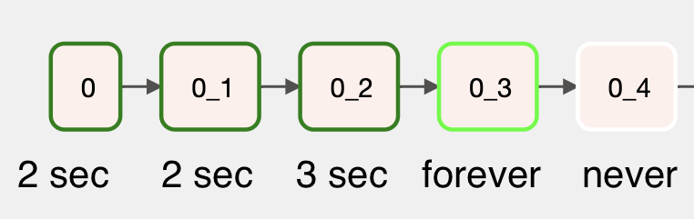

This repo exists to outline a bug.  Unless you're trying to fix that bug, it's probably not helpful for you.


[The problematic DAG](increment.py) runs comands like these, each in their own task:

```
kubectl run asdf --rm --restart=Never -i --image=bash -- sleep 0
kubectl run qwer --rm --restart=Never -i --image=bash -- sleep 0.1
kubectl run zxcv --rm --restart=Never -i --image=bash -- sleep 0.2
.
.
.
kubectl run uiop --rm --restart=never -i --image=bash -- sleep 1.9
kubectl run uiop --rm --restart=never -i --image=bash -- sleep 2
```

When executed via the SequentialExecutor, it works as expected: all tasks complete.
If executed via the KubernetesExecutor, it gets stuck eventually:



Here's some info about the affected version:

```
❯ kubectl exec -n freezebug freezebug-scheduler-b666d9ff5-psktf -c scheduler -- airflow info

Apache Airflow
version                | 2.1.3
executor               | KubernetesExecutor

Tools info
kubectl         | Client Version: v1.22.1
```

The logs don't show anything too juicy:

**happy task.log**
```
{logging_mixin.py:109} INFO - command:
{logging_mixin.py:109} INFO - kubectl run okqoklx --rm -n freezebug --restart=Never -i --image=bash -- sleep 0.4
{sh.py:670} INFO - <Command "/bin/sh -c 'kubectl run okqoklx --rm -n freezebug --restart=Never -i --image=bash -- sleep 0.4'", pid 14>: process started
{logging_mixin.py:109} INFO - result:
{logging_mixin.py:109} INFO - pod "okqoklx" deleted
{logging_mixin.py:109} INFO -
{python.py:151} INFO - Done. Returned value was: None
{taskinstance.py:1211} INFO - Marking task as SUCCESS. dag_id=increment, task_id=0_4, execution_date=20210830T040305, start_date=20210830T040342, end_date=20210830T040345
{local_task_job.py:151} INFO - Task exited with return code 0
{local_task_job.py:261} INFO - 1 downstream tasks scheduled from follow-on schedule check
```

**sad task.log**
```
{logging_mixin.py:109} INFO - command:
{logging_mixin.py:109} INFO - kubectl run kpjgioi --rm -n freezebug --restart=Never -i --image=bash -- sleep 0.5
{sh.py:670} INFO - <Command "/bin/sh -c 'kubectl run kpjgioi --rm -n freezebug --restart=Never -i --image=bash -- sleep 0.5'", pid 15>: process started
```

**scheduler.log**
```
[04:03:46,754] {kubernetes_executor.py:147} INFO - Event: increment04.95f89d7ad4aa4066862348711e56fd87 had an event of type MODIFIED
[04:03:46,755] {kubernetes_executor.py:205} INFO - Event: increment04.95f89d7ad4aa4066862348711e56fd87 Succeeded
[04:03:46,757] {kubernetes_executor.py:631} INFO - Deleted pod: TaskInstanceKey(dag_id='increment', task_id='0_4', execution_date=datetime.datetime(2021, 8, 30, 4, 3, 5, 174490, tzinfo=tzlocal()), try_number=1) in namespace freezebug
[04:03:46,758] {scheduler_job.py:611} INFO - Executor reports execution of increment.0_4 execution_date=2021-08-30 04:03:05.174490+00:00 exited with status None for try_number 1
[04:03:46,762] {kubernetes_executor.py:147} INFO - Event: increment04.95f89d7ad4aa4066862348711e56fd87 had an event of type DELETED
[04:03:46,762] {kubernetes_executor.py:205} INFO - Event: increment04.95f89d7ad4aa4066862348711e56fd87 Succeeded
[04:03:46,812] {kubernetes_executor.py:368} INFO - Attempting to finish pod; pod_id: increment04.95f89d7ad4aa4066862348711e56fd87; state: None; annotations: {'dag_id': 'increment', 'task_id': '0_4', 'execution_date': '2021-08-30T04:03:05.174490+00:00', 'try_number': '1'}
[04:03:46,813] {kubernetes_executor.py:368} INFO - Attempting to finish pod; pod_id: increment04.95f89d7ad4aa4066862348711e56fd87; state: None; annotations: {'dag_id': 'increment', 'task_id': '0_4', 'execution_date': '2021-08-30T04:03:05.174490+00:00', 'try_number': '1'}
[04:03:46,814] {kubernetes_executor.py:546} INFO - Changing state of (TaskInstanceKey(dag_id='increment', task_id='0_4', execution_date=datetime.datetime(2021, 8, 30, 4, 3, 5, 174490, tzinfo=tzlocal()), try_number=1), None, 'increment04.95f89d7ad4aa4066862348711e56fd87', 'freezebug', '6086437') to None
[04:03:46,818] {kubernetes_executor.py:631} INFO - Deleted pod: TaskInstanceKey(dag_id='increment', task_id='0_4', execution_date=datetime.datetime(2021, 8, 30, 4, 3, 5, 174490, tzinfo=tzlocal()), try_number=1) in namespace freezebug
[04:03:46,818] {kubernetes_executor.py:546} INFO - Changing state of (TaskInstanceKey(dag_id='increment', task_id='0_4', execution_date=datetime.datetime(2021, 8, 30, 4, 3, 5, 174490, tzinfo=tzlocal()), try_number=1), None, 'increment04.95f89d7ad4aa4066862348711e56fd87', 'freezebug', '6086438') to None
[04:03:46,822] {kubernetes_executor.py:631} INFO - Deleted pod: TaskInstanceKey(dag_id='increment', task_id='0_4', execution_date=datetime.datetime(2021, 8, 30, 4, 3, 5, 174490, tzinfo=tzlocal()), try_number=1) in namespace freezebug
[04:03:46,822] {scheduler_job.py:611} INFO - Executor reports execution of increment.0_4 execution_date=2021-08-30 04:03:05.174490+00:00 exited with status None for try_number 1
[04:03:47,035] {kubernetes_executor.py:147} INFO - Event: increment05.f23111a9b2a144c0a4a841bb02a101a1 had an event of type MODIFIED
[04:03:47,035] {kubernetes_executor.py:208} INFO - Event: increment05.f23111a9b2a144c0a4a841bb02a101a1 is Running
[04:05:50,186] {scheduler_job.py:1197} INFO - Resetting orphaned tasks for active dag runs
```
